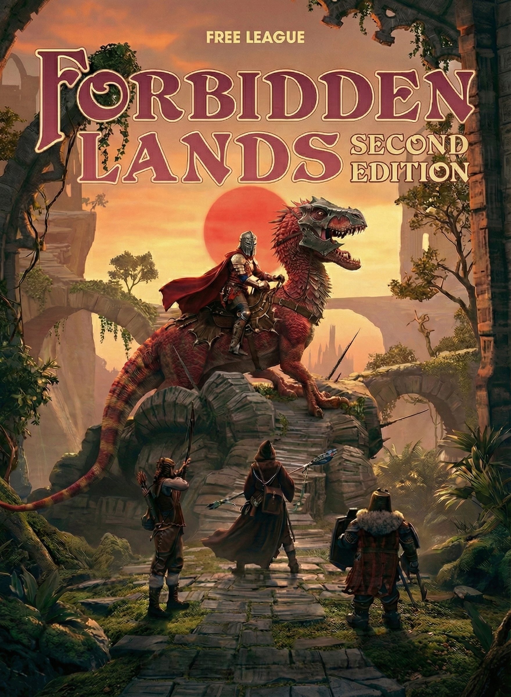

# Forbidden Lands 2E

Unofficial public workbench for a heavily revised Forbidden Lands 2E manuscript and a living proposal area for future revisions.

## Status

This repository is a public draft space, not an official release.

It contains:

- an integrated `corebook/` manuscript
- a `proposals/` folder with design notes, draft rules, and other work-in-progress material

The project is intended as a third-party supplement effort for Forbidden Lands, but the copied manuscript is a full working draft and should be treated as editorial and design material, not as a compliance guarantee under Free League's license.

## Important License Context

Free League published the official [Forbidden Lands Third-Party Tabletop Module License v1.0, dated March 31, 2026](https://freeleaguepublishing.com/wp-content/uploads/2026/03/Forbidden-Lands-License-Agreement-version-1.0.pdf).

That license allows compatible supplements for Forbidden Lands, but it also states important limits, including:

- a supplement must require the Forbidden Lands core game and cannot be a standalone product
- you may not include a copy of the Forbidden Lands rules
- supplement rules may not replace the official core rules in whole or in part
- you may not use Free League text, artwork, or trade dress except as expressly permitted

Because this repository includes a heavily revised integrated manuscript, anyone intending to publish, sell, or distribute it publicly should review the official license carefully and obtain their own legal comfort before treating this repository as a releasable supplement.

## Notice

This project is not affiliated with, sponsored, or endorsed by Fria Ligan AB / Free League.

This repository references Forbidden Lands under Free League's third-party license program.

## Generative AI Disclosure

This repository includes AI-assisted drafting and editing. If any part of this project is ever offered for sale as a supplement, the Free League license currently requires a clear disclosure for generative AI text or art.

## Repository Layout

- `corebook/`
  - The integrated working manuscript and its chapter-level changelog.
- `proposals/`
  - Draft proposals, design notes, and staging material for future revisions.
- `AGENTS.md`
  - Root authoring and repository guidance for this public copy.
- `LICENSE.md`
  - Public-facing notice describing how this repository relates to the official Free League license.
- `REPOSITORY_METADATA.md`
  - Suggested GitHub description and topic tags.

## Working Principle

The core writing goal is simple:

make the manuscript read like a real game book, not like notes, patches, or AI paraphrase.

## Public Repo Caveat

If this repository is later pushed to GitHub or another public host, it should ideally be presented as one of the following:

- a draft compatibility project
- a design workbench
- a proposal archive feeding a future compliant supplement

It should not be presented as an official or complete replacement core rulebook for Forbidden Lands.
