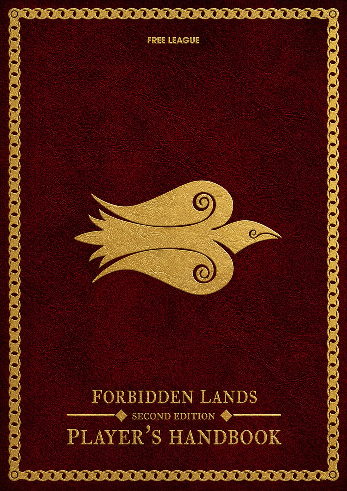
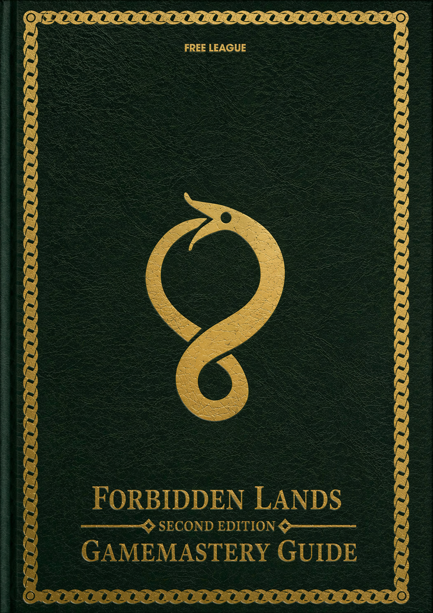
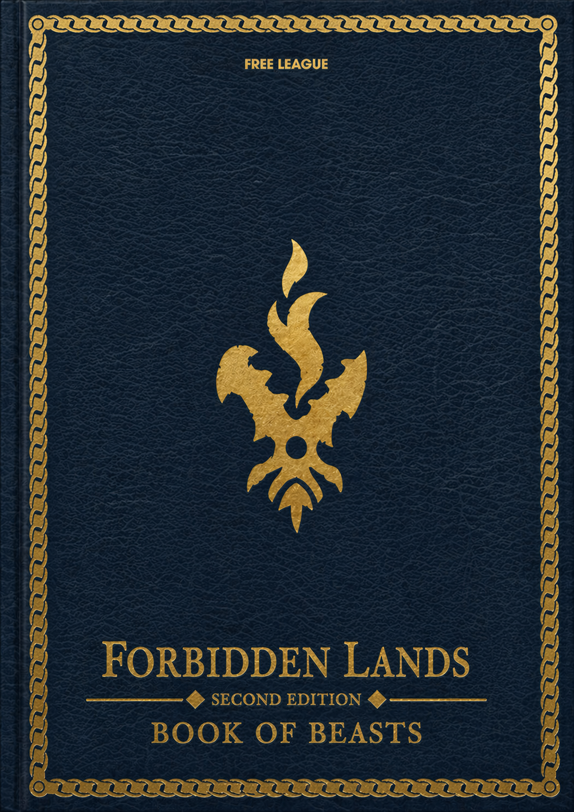

# Forbidden Lands 2E

<table style="width: 90%; border-collapse: collapse; border: none;">
  <tr>
    <td style="width: 33.333%; border: none; padding: 0; text-align: center;">
      
    </td>
    <td style="width: 33.333%; border: none; padding: 0; text-align: center;">
      
    </td>
    <td style="width: 33.333%; border: none; padding: 0; text-align: center;">
      
    </td>
  </tr>
</table>

Public workbench for a heavily revised Forbidden Lands 2E manuscript set.

## Overview

This repository contains three 2nd Edition book manuscripts:

- `01-corebook/`
- `02-gamemasters-guide/`
- `03-book-of-beasts/`

The manuscripts are working drafts and should be treated as editorial and design material rather than compliance-reviewed publications.

## License Context

Free League published the official [Forbidden Lands Third-Party Tabletop Module License v1.0, dated March 31, 2026](https://freeleaguepublishing.com/wp-content/uploads/2026/03/Forbidden-Lands-License-Agreement-version-1.0.pdf).

That license allows compatible supplements for Forbidden Lands, but it also states important limits, including:

- a supplement must require the Forbidden Lands core game and cannot be a standalone product
- you may not include a copy of the Forbidden Lands rules
- supplement rules may not replace the official core rules in whole or in part
- you may not use Free League text, artwork, or trade dress except as expressly permitted

Anyone intending to publish, sell, or distribute material from this repository should review the official license carefully and obtain their own legal comfort before treating it as a releasable supplement.

## Notice

This project is not affiliated with, sponsored, or endorsed by Fria Ligan AB / Free League.

This repository references Forbidden Lands under Free League's third-party license program.

## Generative AI Disclosure

This repository includes AI-assisted drafting and editing.
