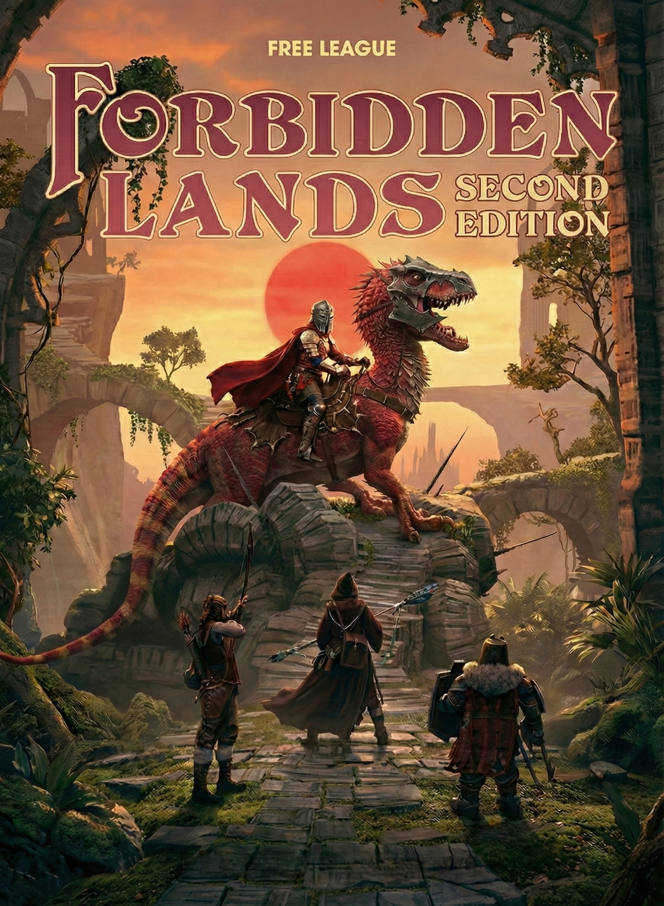

# Forbidden Lands 2E

Public workbench for a heavily revised Forbidden Lands 2E manuscript and a living proposal area for future revisions.

## Overview

This repository contains:

- an integrated `corebook/` manuscript
- a `proposals/` folder with design notes, draft rules, and other work-in-progress material

The project is intended as a third-party supplement effort for Forbidden Lands. The manuscript remains a working draft and should be treated as editorial and design material rather than a compliance-reviewed publication.

## License Context

Free League published the official [Forbidden Lands Third-Party Tabletop Module License v1.0, dated March 31, 2026](https://freeleaguepublishing.com/wp-content/uploads/2026/03/Forbidden-Lands-License-Agreement-version-1.0.pdf).

That license allows compatible supplements for Forbidden Lands, but it also states important limits, including:

- a supplement must require the Forbidden Lands core game and cannot be a standalone product
- you may not include a copy of the Forbidden Lands rules
- supplement rules may not replace the official core rules in whole or in part
- you may not use Free League text, artwork, or trade dress except as expressly permitted

Anyone intending to publish, sell, or distribute material from this repository should review the official license carefully and obtain their own legal comfort before treating it as a releasable supplement.

## Notice

This project is not affiliated with, sponsored, or endorsed by Fria Ligan AB / Free League.

This repository references Forbidden Lands under Free League's third-party license program.

## Generative AI Disclosure

This repository includes AI-assisted drafting and editing. If any part of this project is ever offered for sale as a supplement, the Free League license currently requires a clear disclosure for generative AI text or art.

## Repository Layout

- `corebook/`
  - The integrated working manuscript and its chapter-level changelog.
- `proposals/`
  - Draft proposals, design notes, and staging material for future revisions.
- `AGENTS.md`
  - Root authoring and repository guidance for this public copy.
- `LICENSE.md`
  - Public-facing notice describing how this repository relates to the official Free League license.
- `REPOSITORY_METADATA.md`
  - Suggested GitHub description and topic tags.

## Editorial Principle

The core writing goal is simple: make the manuscript read like a real game book, not like notes, patches, or AI paraphrase.
